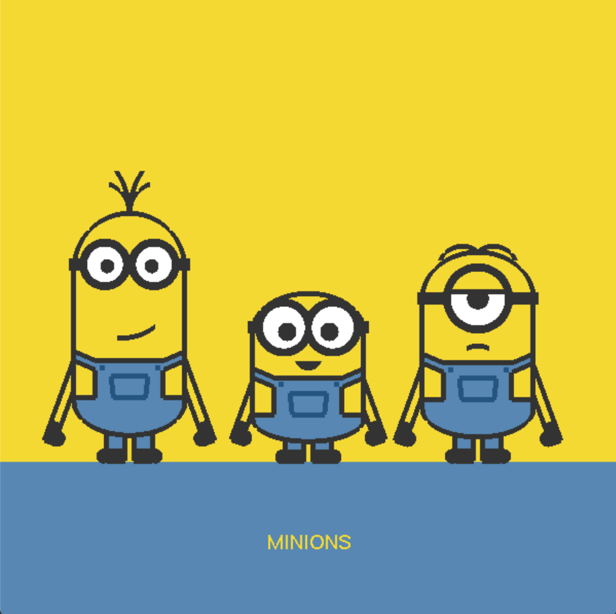
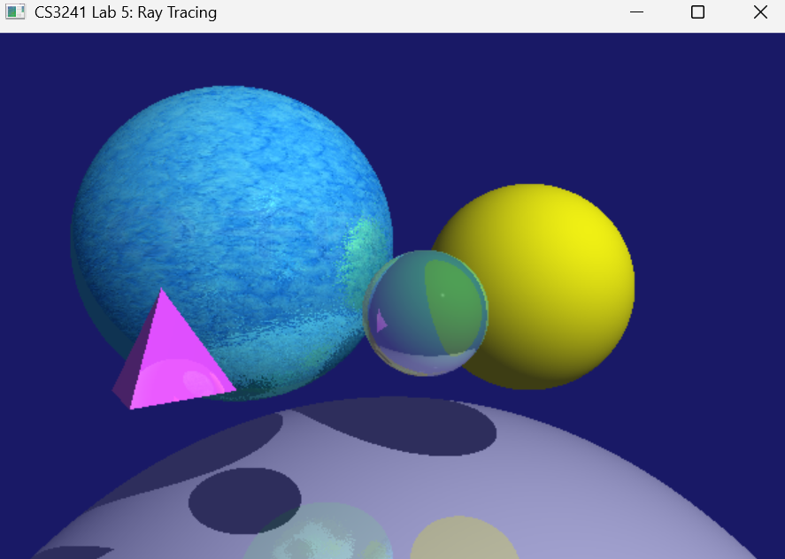

### CS3241 Assignments
#### 1. Doodle

#### 2. Around the world
<video src="Assignment2Around_the_World/CS3241_Assignment2.mp4" controls width="400"></video>

#### 3. Let there be light
<video src="Assignment3Let_there_be_light/CS3241_Assignment3candle.mp4" controls width="400"></video>
<video src="Assignment3Let_there_be_light/CS3241_Assignment3wine_bottle.mp4" controls width="400"></video>

#### 4. Bezier
<video src="Assignment4Bezier/CS3241Assignment4.mp4" controls width="400"></video>)

#### 5. Ray tracing

